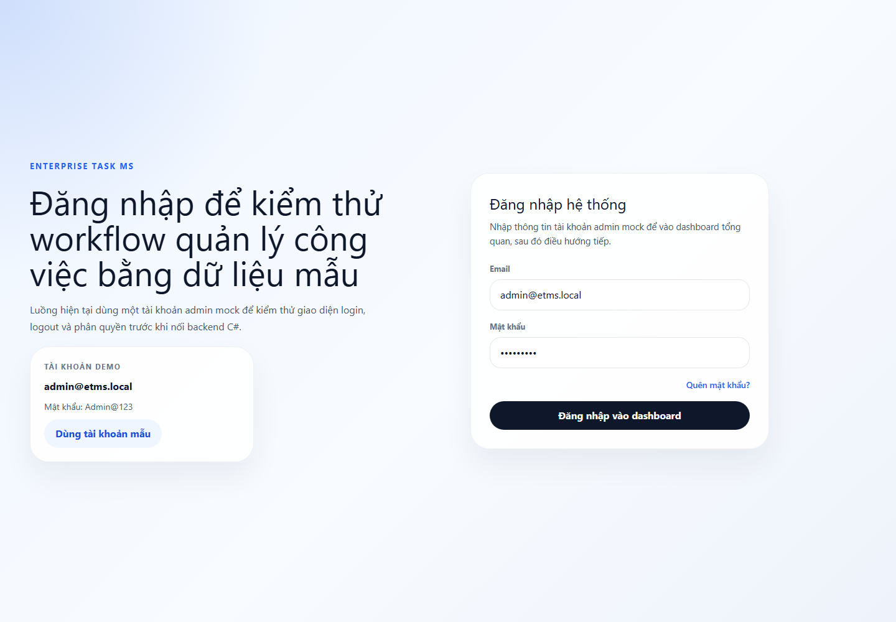

# Enterprise Task Management System

Full-stack task management system for internal enterprise workflows. The project demonstrates an ASP.NET Core Web API backend, an Angular frontend, JWT authentication, and PostgreSQL/Supabase integration.

## Tech Stack

- Backend: ASP.NET Core Web API, JWT Bearer Authentication, Swagger/OpenAPI
- Data: Supabase PostgreSQL, EF Core DbContext configured with Npgsql, PostgreSQL query/command services
- Frontend: Angular, Angular Router, HttpClient, Signals, Guards, Interceptors
- Tooling: .NET user secrets, Angular CLI, npm

## Key Features

- Login/logout flow with JWT token storage and backend token validation
- Protected Angular routes and API authorization
- Task board with status groups, priority, progress, deadlines, assignee transfer, and task duplication
- Task detail drawer with subtasks, processing notes, comments, activity timeline, extension requests, and completion confirmation
- Project overview with task progress rollup
- Department dashboard and inter-department request workflow
- Mock data fallback for frontend development when the API is not running
- Swagger UI for API exploration during development

## Demo Flow

1. Open the Angular app and sign in with the demo account shown on the login screen.
2. Review workload and deadline summaries on the dashboard.
3. Open the task board, create or update a task, move it through workflow actions, and inspect the detail drawer.
4. Add subtasks, update progress, request an extension, or transfer the assignee.
5. Open projects to see task progress grouped by project.
6. Open inter-department requests to review cross-department workflow and SLA status.
7. Open Swagger at the backend URL to test secured endpoints with a Bearer token.

## Demo Accounts

Frontend mock mode:

- Admin: `admin@etms.local` / `Admin@123`
- Other seeded mock users use `Mock@123`

Backend seed mode:

- Admin email: `admin@etms.local`
- User emails include `chau.hr@etms.local`, `long.it@etms.local`, and `tran.dev@etms.local`
- Backend seed is currently a no-op. Create users in Supabase Auth, then assign roles in `public.user_roles`. Do not commit real passwords.

## Screenshots

Portfolio screenshots live in `docs/screenshots/`.



Recommended screenshots to add after running through the authenticated demo flow:

- `dashboard.png`: overview cards and deadline summary
- `task-board.png`: task board grouped by workflow status
- `task-detail.png`: task detail drawer with subtasks and activity history
- `projects.png`: project progress overview
- `inter-department-requests.png`: request workflow and SLA view

## Run Locally

### Backend

```powershell
cd backend\EnterpriseTask\EnterpriseTask.Api
dotnet user-secrets set "ConnectionStrings:DefaultConnection" "Host=YOUR_SUPABASE_HOST;Port=5432;Database=postgres;Username=postgres;Password=YOUR_PASSWORD;SSL Mode=Require;Trust Server Certificate=true"
dotnet user-secrets set "Jwt:Secret" "CHANGE_ME_TO_A_LONG_LOCAL_DEV_SECRET_AT_LEAST_32_CHARS"
dotnet user-secrets set "Jwt:Issuer" "EnterpriseTaskMS"
dotnet user-secrets set "Jwt:Audience" "EnterpriseTaskMSUsers"
dotnet user-secrets set "Auth:RefreshTokenDays" "14"
dotnet user-secrets set "Supabase:Url" "https://YOUR_PROJECT_REF.supabase.co"
dotnet user-secrets set "Supabase:AnonKey" "YOUR_SUPABASE_ANON_PUBLIC_KEY"
dotnet run --launch-profile https
```

Swagger UI is available at `/swagger` in development.

Apply database migrations in Development:

```http
POST /api/dev/migrate
```

Check database/migration health:

```http
GET /api/health/database
```

See `docs/database/README.md` for the forward-only migration workflow, Supabase Auth profile setup, and recovery notes. `supabase_schema_v2_clean.sql` remains a destructive reset script for disposable local/demo databases only.

### Frontend

```powershell
cd enterprise-task-ms
npm install
npm start
```

The frontend runs at `http://localhost:4200` and calls the API base URL defined in `src/app/core/constants/app.constants.ts`.

## Test Commands

Backend:

```powershell
dotnet test backend\EnterpriseTask\EnterpriseTask.slnx
```

Frontend:

```powershell
cd enterprise-task-ms
npm.cmd test -- --watch=false
```

## API Summary

| Area | Endpoints |
| --- | --- |
| Auth | `POST /api/auth/login`, `GET /api/auth/me` |
| Tasks | `GET /api/tasks`, `POST /api/tasks`, `PUT /api/tasks/{id}`, task status, assignee, comments, subtasks, duplication, extension review |
| Projects | `GET /api/projects` |
| Departments | `GET /api/departments` |
| Inter-department requests | list, update status, confirm close, messages/workflow endpoints |
| Development | database seed endpoint for local development |
| Health | `GET /api/health/database` |

## Portfolio Notes

Use this wording for the data layer:

> Configured EF Core DbContext with Npgsql and implemented PostgreSQL query/command services for backend data access and processing.

Avoid claiming this project uses EF Core entity modeling unless entity classes and model mappings are added later. The frontend includes NgRx dependencies and a small reducer, but the main application state currently uses Angular signals and services, so NgRx should not be emphasized in the portfolio description.
